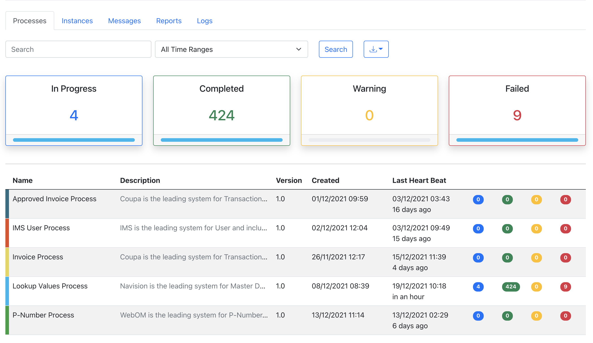

# Process Report Starter

> Dependency management is a critical aspects of any complex project. And doing this manually is less than ideal; the
> more time you spent on it the less time you have on the other important aspects of the project.
> Process report Starter were built to address exactly this problem. You get a one-stop-shop for all the functionality
> that you need to audit your process flow.





## Requirements

* NPM package
  ```
    npm install process-reporting-ts
  ```
* @BpmnElement on method
  ```
    import {BpmnElement} from "process-reporting-ts";
  
    @BpmnElement(id = "Event_1anjljr", startEvent = true, keyExpression = "{{ event.PO_NUMBER }}")
    public execute(PurchaseOrderEvent event) {

        return ...;
    }

    ----

    @BpmnElement(id = "Activity_194xhhj")
    public execute(PurchaseOrder data) {

        return ...;
    }

    ---

    @BpmnElement(id = "Event_0byexdn", endEvent = true)
    public execute(ProcurementOrder procurementOrder, boolean purchaseOrderExists) {

        return ...;
    }
  ```
* AOP on function
```
import {interceptHandler} from "process-reporting-ts";

function execute(PurchaseOrderEvent data) {

   return ...
}

const aopHandler = interceptHandler(execute, {
    startEvent: true,
    instanceIdExpression: '{{ data.PO_NUMBER }}',
    keyExpression: '{{ input }}'
})

```

* .env
  ```
  REPORTING_PROCESS_ID: Process_0e2hw2v
  REPORTING_PROCESS_SERVER: http://localhost:9090/reporting-service/rest
  REPORTING_PROCESS_VERSION: 1.0
  ```
* BPMN process-flow.bpmn
    * 

## Testing

### Unit Test

```npm test```

## API

### REST Report API

```
@POST ${reporting.server}/api/report

@BODY {
    ...@ReportEvent
}
```

### REST Process API

```
@POST ${reporting.server}/api/process

@BODY {
    ...@ProcessEvent
}
```

### REST Heart Beat API

```
@POST ${reporting.server}/api/definition/heart-beat

@BODY {
    ...@HeartBeatEvent
}
```

### REST Process Definition API

```
@POST ${reporting.server}/api/definition

@BODY {
    ...@RegisterEvent
}
```

### Reporting Properties

| Name                 | Type   | Required | Default Value | Description                           |
|----------------------|--------|----------|---------------|---------------------------------------|
| processId            | String | true     |               | Unique Process Id                     |
| processName          | String | true     |               | Process Name                          |
| processVersion       | String | true     | 1.0           | Process Version                       |
| server               | String | true     |               | Process Reporting Service             |
| heartBeatCron        | String | false    | 0 */2 * ? * * | report heart beat for current service |
| maxEventContentLimit | int    | false    | 2000          | Max event content size                |

### BaseReportEvent

| Name           | Type          | Required | Default Value | Description                                       |
|----------------|---------------|----------|---------------|---------------------------------------------------|
| transactionId  | String        | true     |               | Unique Transaction Id generated by system         |
| processId      | String        | true     |               | Unique Process Id                                 |
| processVersion | String        | true     | 1.0           | Process Version                                   |
| executionId    | String        | true     |               | Process Unique execution Id generated by system   |
| errorMessage   | String        | false    |               | Error Message during execution                    |
| status         | ReportStatus  | false    |               | report status STARTED, COMPLETED, ...             |
| eventTime      | LocalDateTime | true     | now           | Event time generated by system                    |
| retryCount     | int           | false    | 0             | Retry Count                                       |
| partCount      | int           | false    | 0             | Part Count im Event maxEventContentLimit exceeded |

### ProcessEvent extends BaseReportEvent

| Name               | Type          | Required | Default Value | Description                                    |
|--------------------|---------------|----------|---------------|------------------------------------------------|
| eventTriggeredTime | LocalDateTime | true     |               | Event Triggered time from source system        |
| startBy            | String        | true     |               | who started the process?                       |
| boundedContext     | String        | true     |               | Bounded Context that process belong to         |
| eventType          | String        | true     |               | Event Type CREATED, UPDATED, DELETED, ...      |
| eventSource        | String        | true     |               | Event Source  who throw this event? (System-A) |
| runtimeId          | String        | true     |               | Runtime Id generated by system                 |
| referenceId        | String        | true     |               | Reference Id                                   |

### ReportEvent extends BaseReportEvent

| Name                  | Type   | Required | Default Value | Description                                  |
|-----------------------|--------|----------|---------------|----------------------------------------------|
| elementId             | String | true     |               | BPMN Element unique Id                       |
| multipleInstanceIndex | String | true     |               | Task may be executed multiple times          |
| payload               | String | true     |               | Event Payload like Json or primitive Objects |

### HeartBeatEvent

| Name           | Type          | Required | Default Value | Description                    |
|----------------|---------------|----------|---------------|--------------------------------|
| processId      | String        | true     |               | Unique Process Id              |
| processVersion | String        | true     | 1.0           | Process Version                |
| eventTime      | LocalDateTime | true     | 0             | Event time generated by system |

### RegisterEvent

| Name           | Type   | Required | Default Value | Description                            |
|----------------|--------|----------|---------------|----------------------------------------|
| processDiagram | String | true     |               | Process XML Diagram                    |
| processId      | String | true     |               | Unique Process Id                      |
| processVersion | String | true     | 1.0           | Process Version                        |
| boundedContext | String | true     |               | Bounded Context that process belong to |
| fileName       | String | true     |               | Process XML Diagram file name          |

### ReportStatus

| Type      | Description                                               |
|-----------|-----------------------------------------------------------|
| QUEUED    | Process has been queued                                   |
| STARTED   | Process/Task has been started                             |
| RESTARTED | Process/Task has been restarted                           |
| COMPLETED | Process/Task has been completed                           |
| WARNING   | Task has ended with warning but Process keep running      |
| ERROR     | Task has ended with error and Process has been terminated |

## Technology Stack

* Nodejs v16.20.2
* Third Party Libraries
    * jest 29.5.8
    * model-converter (MIT License)
    * mustache 4.2.5
    * typescript 5.2.2
    * axios-observable 2.0.0
* Code-Analyses
    * Sonar
    * jest coverage

## License

MIT (unless noted otherwise)